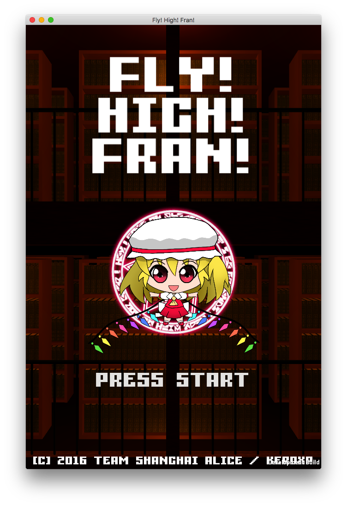

# fly-high-fran
A tiny jump game insipred by Toho Project (a famouse indie STG in Japan).  

# key config

## Standalone

- Space - Start / Pause
- F / Left Click - Jump to left
- J / Right Click - Jump to right

## iOS / Android

- Touch left half of screen - Jump to left
- Touch right half of screen - Jump to right

# Credit

## Staff
- @keroxp
  - Direction
  - Graphic Art
  - 3D Modeling
  - UI Design
  - Rigging & Animation
  - Programming
  - Music Composing

## Software

- Unity3d
  - Game Engine & IDE
- CLIP STUDIO PAINT
  - Character Painting
- Adobe Photoshop CC
  - Grapihc Design
- Adobe Illustrator CC
  - Graphic Design
- Logic Pro X
  - Music Composing
- Blender
  - 3D Modeling
- Spine2d
  - Character Animation
- Visual Studio Code
  - Programming

## Other free asset sites

- http://textures.com
- http://www.dafont.com
- http://osabisi.sakura.ne.jp/m2d
- http://maoudamashii.jokersounds.com/music_se.html
- http://inatsuka.com/extra/magicring/

# Licenses

**All lisences related to original works are reserved by its author.**   
 Except external assets licensed by other lisenses, all source codes, graphics, 3d models, sounds and other components in this project are licensed by Creative-Commons License.

 <a xmlns:cc="http://creativecommons.org/ns#" href="http://github.com/keroxp/fly-high-fran" property="cc:attributionName" rel="cc:attributionURL">keroxp</a> 作『Fly! High! Fran!』は<a rel="license" href="http://creativecommons.org/licenses/by-nc-sa/4.0/">クリエイティブ・コモンズ 表示 - 非営利 - 継承 4.0 国際 ライセンス</a>で提供されています。
